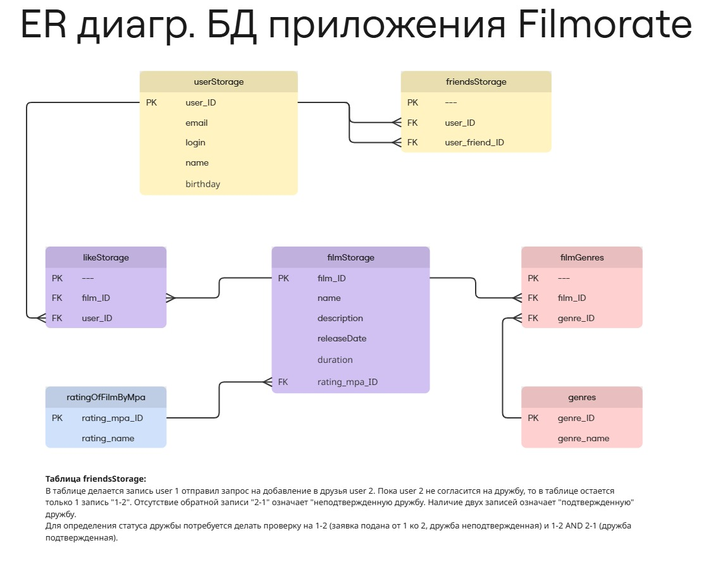

# java-filmorate

Template repository for Filmorate project.

## Диаграмма Базы Данных приложения



## Примеры запросов по работе с БД

## Функционал пользователей

### 1) Получение всех пользователей

```sql
SELECT *  
FROM userStorage;
```

### 2) Возвращаем пользователя по его ID (ID)

```sql
SELECT * 
FROM userStorage
WHERE user_ID = :ID;
```

### 3) Получение списка друзей пользователя c ID (ID)

```sql
SELECT * 
FROM userStorage
WHERE user_ID IN (SELECT fs.user_friend_ID  
			FROM friendsStorage AS fs 
			WHERE fs.user_ID = :ID);
```

### 4) Получение общего списка друзей пользователя с ID1 и ID2

```sql
SELECT * 
FROM userStorage
WHERE user_ID IN (SELECT fs.user_friend_ID 
				FROM friendsStorage AS fs
				WHERE fs.user_ID = :ID1 OR fs.user_ID = :ID2
				GROUP BY fs.user_friend_ID
				HAVING COUNT(fs.user_ID) = 2);
```

## Функционал фильмов

### 1) Получение всех фильмов

```sql
SELECT *  
FROM filmStorage;
```

### 2) Возвращаем фильм по его ID (ID)

```sql
SELECT * 
FROM filmStorage
WHERE film_ID = :ID;
```

### 3) Получаем список фильмов в кол-ве N и отсортированному по количеству лайков

```sql
SELECT fs.*, 
	COUNT(ls.user_ID) AS likes_count
FROM filmStorage AS fs
LEFT JOIN likeStorage AS ls ON fs.film_ID = ls.film_ID
GROUP BY fs.film_ID
ORDER BY likes_count DESC
LIMIT :N;
```